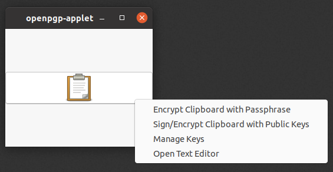

# openpgp-applet-window

This is a fork of the openpgp-applet that replaces the 'applet' part of the applet with a window. This allows the app to be used on systems with newer versions of Gnome that don't support GTK StatusIcons.

To use it, clone the repository and run bin/openpgp-applet

The original repository exists at: https://salsa.debian.org/openpgp-applet-team/openpgp-applet

# Original readme

Copyright (c) 1999-2018 Tails developers <tails@boum.org>

Homepage: https://openpgp-applet-team.pages.debian.net/

Development mailing list:
https://lists.autistici.org/list/openpgp-applet-devel.html

**** OpenPGP_Applet - GNOME applet for OpenPGP text encryption ****

OpenPGP_Applet is a GNOME applet written in Perl that allows encryption and
decryption of the clipboard's content with a symmetric cipher using a
passphrase. This is a graphical front-end on top of GnuPG.

Asymmetric decryption and clipboard verification are also supported.

Formerly a part of Tails - tails.boum.org, now available separately.

IMPORTANT:

OpenPGP_Applet does not handle passphrase input. Since it also does not offer
terminal interaction unless explicitly run from there, it relies in practice on
some kind of GnuPG agent such as Pinentry, Seahorse 2.x or GNOME Keyring 3.x to
manage passphrase input.

Full user documentation, with screenshots, is available at
https://tails.boum.org/doc/encryption_and_privacy/gpgapplet/

INSTALLATION

    OpenPGP_Applet is packaged as a (mostly) standard Perl module.

    To install, you'll need Perl and a few Perl module available from CPAN and,
    chances are, as package for your OS.

    Just run

        perl Makefile.PL

    If you miss some required modules, it will warn you. Install them (via CPAN or
    using your preferred packaging system)¸

    Then, as root or using sudo :

        make install

    Installation will take place in /usr/local by default.

USAGE

    To launch the applet, run "openpgp-applet". It should sit in the system tray or
    the notification area.

    If you encounter issues, find a bug, or want to suggest a feature, please
    open an issue on https://salsa.debian.org/openpgp-applet-team/openpgp-applet

LICENSE

    This program is free software; you can redistribute it and/or modify it
    under the terms of either:

    a) the GNU General Public License as published by the Free Software
       Foundation; either version 1, or (at your option) any later version, or

    b) the "Artistic License" which comes with Perl.

        Both are included in the LICENSE file.

    The pixmaps and icons under share/pixmaps are licensed using the
    Creative Common 1.0 Universal (CC0), included in LICENSE file as
    well. Humans may want to refer to
    http://creativecommons.org/publicdomain/zero/1.0/
